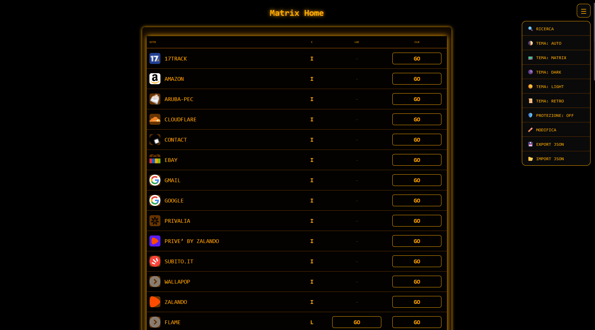
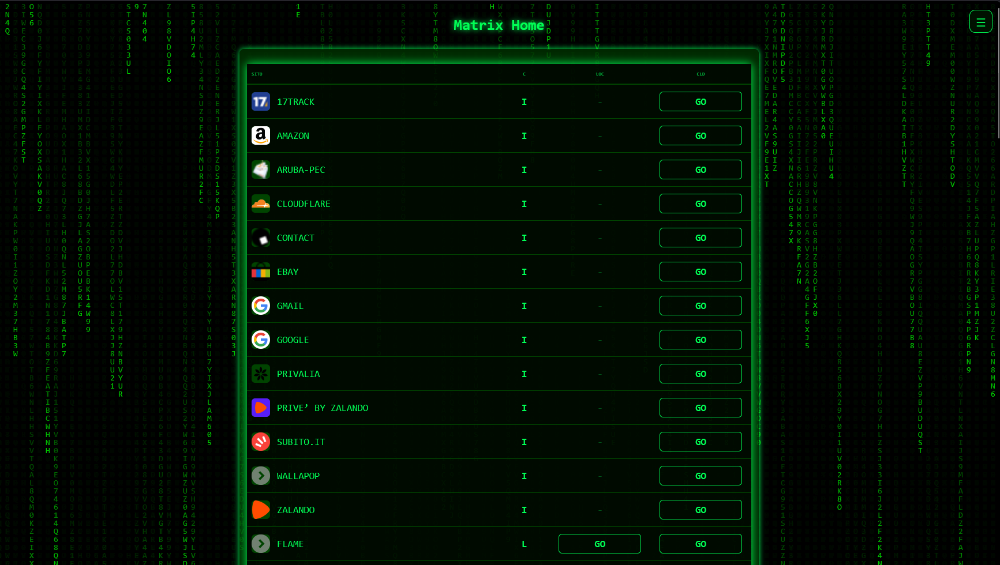
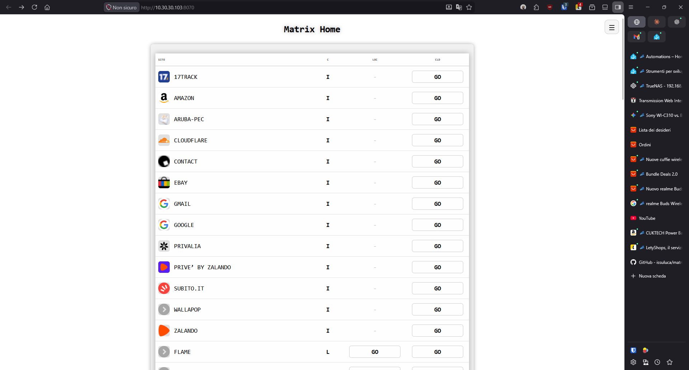

# Matrix Home v1.3.10

Una dashboard minimalista e funzionale per gestire i propri link locali e cloud, con un'estetica ispirata a Matrix e un'interfaccia utente dinamica "stile TV".

 

## 🖼️ Screenshots

| Tema Matrix | Tema Retro | Tema Light |
|:-----------:|:----------:|:----------:|
|  |  |  |

## ✨ Novità della Versione 1.3.0

- 🔐 **Autenticazione Opzionale**: Attivabile o disattivabile direttamente dal menu tramite switch stile iPhone (iOS).
- 📺 **Interfaccia TV-Style**: I pannelli di ricerca, login e inserimento compaiono con un'animazione a tubo catodico (CRT).
- ⌨️ **Ricerca Rapida Intelligente**: Inizia a digitare in qualsiasi momento per attivare la barra di ricerca. La barra scompare automaticamente se il campo viene svuotato.
- 🔤 **Ordinamento Dinamico**: Clicca sulle intestazioni delle colonne (SITO o GRUPPO) per ordinare i link alfabeticamente (A-Z / Z-A).
- 🎯 **Menu Intuitivo**: Il menu laterale si chiude automaticamente cliccando in qualsiasi punto esterno della pagina.
- 🎨 **Temi Originali v1.1.0**: Ripristinata la coerenza cromatica dei temi:
  - **Light**: Sfondo bianco pulito.
  - **Matrix**: Pioggia di codice (attiva solo in questo tema).
  - **Dark & Retro**: Colori fedeli alla versione classica.

## 🚀 Installazione Rapida (Docker)

### Docker Run

```bash
docker run -d \
  -p 8070:8070 \
  -v matrix-home-data:/app/data \
  -e ENABLE_AUTH=false \
  --name matrix-home \
  issuluca/matrix-home:latest
```

### Docker Compose

```bash
docker-compose up -d
```

Visita `http://localhost:8070`

## 🛠️ Architettura del Progetto

- **`server.js`**: Engine Node.js con gestione sessioni e API REST protette.
- **`public/index.html`**: SPA (Single Page Application) con logica JavaScript integrata.
- **`data/` (Volume Persistente)**:
  - `links.json`: Database dei siti salvati.
  - `config.json`: Stato globale dell'autenticazione.
  - `auth.json`: Credenziali utente (generate al primo setup).

## 🎨 Temi Disponibili

Clicca il menu hamburger (☰) in alto a destra:

- **Matrix**: Classico tema Matrix con effetto pioggia di caratteri - il nostro preferito 💚
- **Dark**: Scuro pulito con sfondo nero e tonalità attenuate (stile iPhone)
- **Light**: Chiaro pulito, stile iPhone (si adatta alle preferenze di sistema)
- **Retro Terminal**: Arancione retrò, effetto CRT vintage
- **Auto (System)**: Dark/Light seguono automaticamente le preferenze di sistema operativo

La scelta del tema viene salvata automaticamente.

## 🔐 Sicurezza e Setup

Se l'autenticazione è attiva, al primo accesso il sistema rileverà la mancanza di un account e ti guiderà nel Setup Iniziale.

**Nota**: Le password vengono cifrate tramite hash SHA-256 prima della scrittura su disco per garantire la massima riservatezza.

### Attivare l'Autenticazione

L'autenticazione è **disattivata di default**. Per abilitarla:

#### Opzione 1: Variabile d'ambiente
```bash
docker run -d \
  -e ENABLE_AUTH=true \
  -p 8070:8070 \
  -v matrix-home-data:/app/data \
  --name matrix-home \
  issuluca/matrix-home:latest
```

#### Opzione 2: docker-compose.yml
```yaml
environment:
  - ENABLE_AUTH=true
```

### Toggle nel Menu
Una volta abilitata, nel menu hamburger (☰) compare un toggle 🔐:
- **ON** → Loggato e protetto
- **OFF** → Logout e accesso libero
- **Primo login** crea automaticamente l'account

## 📋 Uso

### Ricerca Rapida (🔍)
- Clicca la lente di ingrandimento accanto a "Matrix Home" per aprire il campo ricerca
- Oppure digita direttamente dovunque (tranne nei campi input) per attivare la ricerca
- La barra si chiude automaticamente quando viene svuotata
- Premi **Escape** per chiudere manualmente

### Menu Hamburger (☰)

In alto a destra:
- **🛠️ Edit** - Attiva/disattiva modalità modifica (mostra input box e bottoni azioni)
- **💾 Export** - Scarica backup JSON dei tuoi link
- **📥 Import** - Carica un backup precedentemente esportato
- **🔐 Auth** - Toggle autenticazione (visibile solo se abilitata)
- **Theme** - Seleziona il tema preferito (Matrix, Dark, Light, Retro, Auto)

### Modalità Edit

Una volta attivata (🛠️ Edit):
- **Aggiungi**: Compila i 4 campi (Site, Group, Local URL, Cloud URL) e clicca "Add"
- **Modifica**: Clicca il bottone ✏️ accanto al link da modificare
- **Elimina**: Clicca il bottone 🗑️

I campi input compaiono **SOLO in modalità edit**.

## 📁 Formato Link

```json
{
  "SITO": "AMAZON",
  "GROUP": "INTERNET",
  "LOCAL": "http://192.168.1.1/app",
  "CLOUD": "https://amazon.it"
}
```

- **SITO**: Nome del servizio (obbligatorio)
- **GROUP**: Categoria/Etichetta (opzionale)
- **LOCAL**: URL interno/locale (opzionale)
- **CLOUD**: URL esterno/cloud (opzionale)

## 🔧 Configurazione

### Variabili d'Ambiente

- `PORT`: Porta interna (default: 8070)
- `ENABLE_AUTH`: Abilita autenticazione (default: false)

```bash
docker run -d \
  -e PORT=3000 \
  -e ENABLE_AUTH=true \
  -p 3000:3000 \
  -v matrix-home-data:/app/data \
  --name matrix-home \
  issuluca/matrix-home:latest
```

### Con Cloudflare Access/Tunnel

Se usi Cloudflare per l'autenticazione esterna, Matrix Home rimane senza auth (ENABLE_AUTH=false) e deleghi tutto a Cloudflare.

## 📦 Backup e Restore

### Via Web Interface (Consigliato)

**Export:**
1. Clicca ☰ → 💾 Export
2. Scarica automaticamente il file JSON con data corrente

**Import:**
1. Clicca ☰ → 📥 Import
2. Seleziona il file JSON dal tuo computer
3. Conferma per sostituire tutti i link attuali

### Via Docker

**Backup:**
```bash
docker cp matrix-home:/app/data ./backup
```

**Restore:**
```bash
docker cp ./backup/. matrix-home:/app/data/
docker restart matrix-home
```

## 🔒 Sicurezza

- ✅ Validazione input server-side rigorosa
- ✅ Escape HTML per prevenire XSS
- ✅ URL validation prima di salvare
- ✅ Password hashate con SHA-256 (se auth abilitata)
- ✅ Token-based authentication con localStorage
- ✅ Error handling robusto
- ✅ Caching in memoria per performance

**Nota**: Se non usi l'autenticazione integrata, proteggi Matrix Home con:
- **Cloudflare Access/Tunnel** (consigliato)
- **Reverse proxy con auth** (nginx, Traefik)
- **VPN privata**

## 🛠️ Local Development

```bash
git clone https://github.com/issuluca/matrix-home.git
cd matrix-home

npm install
npm start
```

Accedi a `http://localhost:8070`

## 🐛 Troubleshooting

### Reset completo (incluso credenziali)

```bash
docker exec matrix-home rm /app/data/links.json /app/data/credentials.json
docker restart matrix-home
```

### Login bloccato

Se non riesci ad accedere:
```bash
docker exec matrix-home rm /app/data/credentials.json
docker restart matrix-home
```

Al prossimo accesso, il primo login crea un nuovo account.

### Temi non cambiano

Pulisci il localStorage:
```javascript
// Dalla console browser (F12)
localStorage.clear();
location.reload();
```

### Container unhealthy

Assicurati che il server sia in ascolto sulla porta corretta e il volume sia montato:
```bash
docker logs matrix-home
docker inspect matrix-home
```

## 📝 Changelog

### v1.3.10
- ✅ Aggiornamento versione e documentazione
- ✅ Screenshot temi aggiornati (Matrix, Retro, Light)

### v1.3.0
- ✅ **Autenticazione Toggle** - Switch stile iPhone nel menu
- ✅ **Interfaccia TV-Style** - Animazioni CRT per ricerca e login
- ✅ **Ricerca Intelligente** - Si attiva scrivendo, si chiude se vuota
- ✅ **Ordinamento Dinamico** - Clicca le intestazioni per ordinare
- ✅ **Menu Auto-Close** - Si chiude cliccando fuori
- ✅ **Temi Ripristinati** - Coerenza cromatica v1.1.0

## 📝 Licenza

MIT License – Sentiti libero di usare e modificare!

## 🤝 Contributi

Contributi, issues e feature requests sono benvenuti!

## 🙏 Grazie

Realizzato con ❤️

---

Made with 💚 and Matrix vibes
