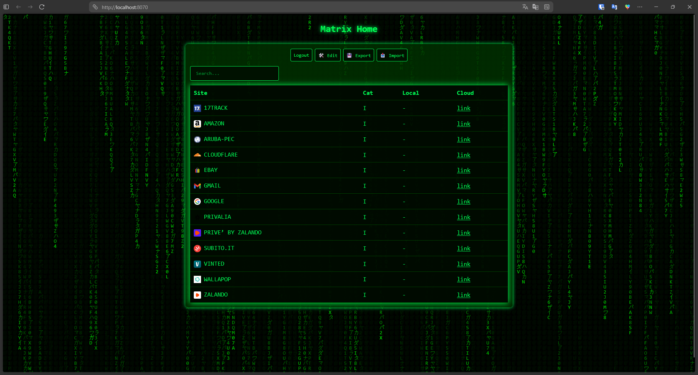

# Matrix Home



A Matrix-style homepage to manage your personal links with secure authentication.

 

## ✨ Features

- 🎨 Matrix-style interface with falling characters effect
- 🔐 Secure authentication system with hashed passwords
- 📝 Full link management (Add, Edit, Delete)
- 🔍 Real-time search
- 📱 Responsive design for mobile and desktop
- 💾 Data persistence via Docker volume
- ⚡ Auto-login for 24 hours

## 🚀 Quick Start

### Docker Run

```bash
docker run -d   -p 8070:8070   -v matrix-home-data:/app/data   --name matrix-home   issuluca/matrix-home:latest
```

### Docker Compose

```yaml
version: '3.8'

services:
  matrix-home:
    image: issuluca/matrix-home:latest
    container_name: matrix-home
    ports:
      - "8070:8070"
    volumes:
      - matrix-home-data:/app/data
    restart: unless-stopped

volumes:
  matrix-home-data:
```

## 📋 First Launch

1. Start the container
2. Visit `http://localhost:8070`
3. Create your admin account (username and password)
4. Start managing your links!

## 🔧 Configuration

### Custom Port

```bash
docker run -d   -p 3000:8070   -v matrix-home-data:/app/data   --name matrix-home   issuluca/matrix-home:latest
```

### Environment Variables

- `PORT`: Internal server port (default: 8070)

## 📁 Data Structure

Data is stored in the Docker volume at `/app/data`:
- `credentials.json`: Hashed admin credentials
- `links.json`: Link database

### Link Format

```json
{
  "SITE": "SITE NAME",
  "GROUP": "CATEGORY",
  "LOCAL": "http://local-link",
  "CLOUD": "http://cloud-link"
}
```

## 🛠️ Local Build

```bash
# Clone repository
git clone https://github.com/issuluca/matrix-home.git
cd matrix-home

# Build image
docker build -t matrix-home .

# Run
docker run -d -p 8070:8070 -v matrix-home-data:/app/data matrix-home
```

## 📦 Backup and Restore

### Using the Web Interface (Recommended)

**Export:**
1. Click the 💾 **Export** button
2. A JSON file containing your links will be downloaded
3. Save it in a safe place

**Import:**
1. Click the 📥 **Import** button
2. Select your backup JSON file
3. Confirm to replace all current links

### Using Docker Commands

**Backup:**
```bash
docker cp matrix-home:/app/data ./backup
```

**Restore:**
```bash
docker cp ./backup/. matrix-home:/app/data/
docker restart matrix-home
```

## 🔒 Security

- Passwords hashed with SHA-256
- Secure session cookies
- Auto-logout after 24 hours of inactivity
- No plain-text passwords in the database

## 🐛 Troubleshooting

### Reset Password

If you forgot your password:

```bash
docker exec matrix-home rm /app/data/credentials.json
docker restart matrix-home
```

Then visit the app and reconfigure your credentials.

## 📝 License

MIT License – Feel free to use and modify!

## 🤝 Contributions

Contributions, issues, and feature requests are welcome!

## 🙏 Thanks

This project was created with the help of ChatGPT and Claude AI.

## 📧 Contact

For questions or support, open an issue on GitHub.

---

Made with 💚 and Matrix vibes
